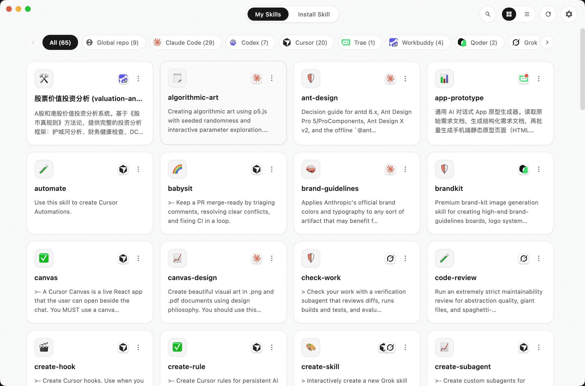

<div align="center">


# Skillkit

**One home for AI coding skills — across 20 agents.**

[English](./README.md) · [简体中文](./README.zh-CN.md)

[](https://github.com/robotbird/skillkit/releases)
[](./LICENSE)
[](https://github.com/robotbird/skillkit/releases)
[](https://www.electronjs.org/)
[](#-contributing)

<br />

Install & uninstall skills across all your AI coding tools, and share your own skills with anyone via a short link — all from one place.

**[⬇️ Download for macOS / Windows](https://github.com/robotbird/skillkit/releases)**

</div>

<br />

<div align="center">
  
</div>

## ✨ Features

- **📥 Install anywhere** — install a skill into one or more agents at once, from a **GitHub URL**, a **share link**, or a local **`.zip`**.
- **🧹 Uninstall cleanly** — auto-scans every agent's skill directory. One-click uninstall (built-in skills are protected and can't be removed).
- **🔗 Share via short link** — turn any installed skill into a `skillkit.net/share/<id>` link valid for 7 days. Recipients install it with a single click.
- **🌗 Light & dark** — a warm, calm UI in both themes.
- **🌐 Bilingual** — runs in **English** or **简体中文**.

## 🤖 Supported agents (20)

Skillkit reads and writes the skill directories of:

> Claude Code · Codex · Cursor · Trae · Workbuddy · Qoder · Grok · OpenCode · Gemini CLI · Antigravity · Windsurf · Augment · CodeBuddy · Pi · Kiro CLI · Hermes · OpenClaw · Cline · Warp · Kimi Code CLI

Directory paths align with [`vercel-labs/skills`](https://github.com/vercel-labs/skills). Cline, Warp, and Kimi Code CLI share the global `~/.agents/skills` store.

## 📥 Download

Grab the latest build for your platform from **[GitHub Releases](https://github.com/robotbird/skillkit/releases)**:

| Platform | Artifact |
| --- | --- |
| **macOS** (Apple Silicon) | `.dmg` / `.zip` |
| **Windows** | `.exe` (NSIS installer) |

> The app checks for updates in the background and self-updates via `electron-updater`, so you only need to install manually once.

## 🗂️ Tabs

- **My Skills** — every skill found across all your agents, filterable by tool, searchable, in a grid or list. Uninstall or share any of them.
- **Install** — three ways to add a skill: paste a GitHub URL, paste a share link (or full URL / bare ID), or drop a `.zip`.

## 🔗 Share

- **Create** — hit *Share* on any installed skill. Skillkit zips it, uploads to the server, and gives you a short link (`https://skillkit.net/share/<id>`) that's installable for 7 days.
- **Install** — paste the short link, the full URL, or just the ID into the *Install* tab.
- **Receiver page** — opening the link in a browser shows a clean HTML page with the skill's details and a one-click `skillkit://` deep link.
- Limits: a single skill ≤ 4 MB; links expire after 7 days (expired reads return `410 Gone`).

## 🖼️ Screenshots

<div align="center">
  
  <br /><br />
  
</div>

---

## 🧑‍💻 For developers

Skillkit is a **pnpm-workspace monorepo**:

| Package | What it is |
| --- | --- |
| [`apps/desktop`](./apps/desktop) | Electron client (React 18 + TypeScript + Vite + better-sqlite3) |
| [`packages/types`](./packages/types) | `@skillkit/types` — cross-end shared types & constants (single source of truth) |

> The share backend (short-link API + 个人中心) runs on **`skillkit.net`** — a separate repo.

For the full architecture deep-dive — three-process Electron model and the share link contract — read [`CLAUDE.md`](./CLAUDE.md).

### Quick start

```bash
pnpm install
pnpm --filter desktop rebuild   # rebuilds better-sqlite3 against Electron's ABI

pnpm --filter desktop dev       # desktop app (vite + electron, watches all 3 bundles)
```

The client defaults to `https://skillkit.net`. To point it at a local server:

```bash
SKILLKIT_SHARE_BASE_URL=http://127.0.0.1:3000 pnpm --filter desktop dev
```

### Build & package

```bash
pnpm --filter desktop build     # typecheck (tsc, both tsconfigs) + vite build
pnpm --filter desktop dist      # → release/ (mac dmg/zip, win nsis)
```

CI (`.github/workflows/build.yml`) packages mac + win on push to `main`; `workflow_dispatch` publishes a GitHub Release that `electron-updater` rolls out.

### Tech stack

Electron · React 18 · TypeScript · Vite · Tailwind v4 + shadcn/ui · better-sqlite3 · pnpm + Turborepo

## 🤝 Contributing

Issues and pull requests are welcome! For anything beyond a small fix, please open an issue first to align on the approach.

## 📄 License

Licensed under the [MIT License](./LICENSE).
