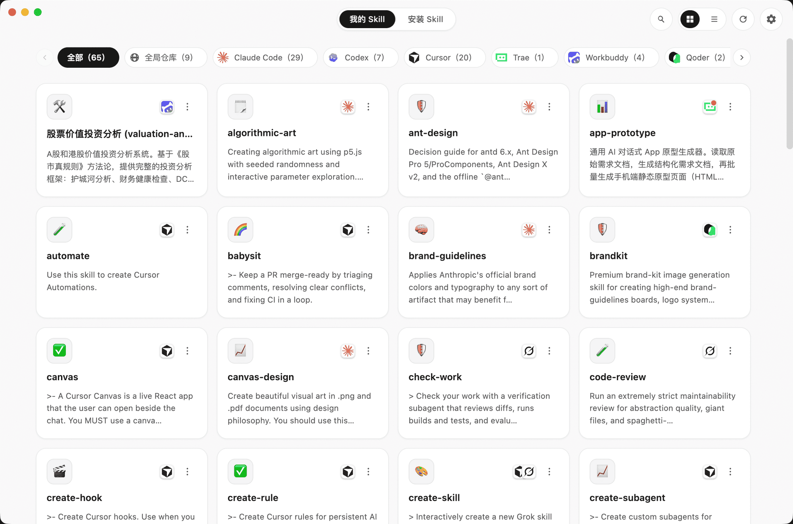
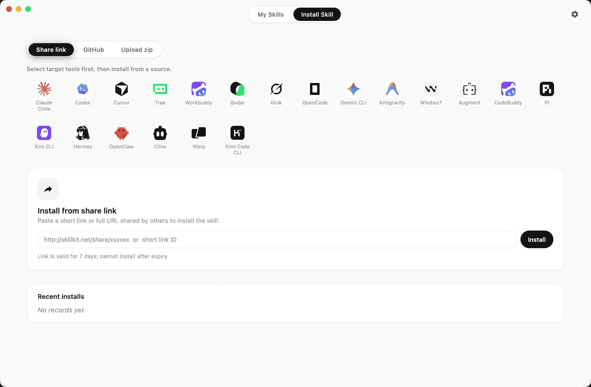

<div align="center">


# Skillkit

**一个家,管好跨 20 个 AI 编程工具的 Skill。**

[English](./README.md) · [简体中文](./README.zh-CN.md)

[](https://github.com/robotbird/skillkit/releases)
[](./LICENSE)
[](https://github.com/robotbird/skillkit/releases)
[](https://www.electronjs.org/)
[](#-贡献)

<br />

给你的 AI 编程工具安装 / 卸载 skill,并通过短链把你的 skill 分享给任何人 —— 全在一个桌面端完成。

**[⬇️ 下载 macOS / Windows 版](https://github.com/robotbird/skillkit/releases)**

</div>

<br />

<div align="center">
  
</div>

## ✨ 特性

- **📥 多端安装** —— 一次性把 skill 装到一个或多个工具,支持 **GitHub URL**、**分享链接**、本地 **`.zip`** 三种来源。
- **🧹 干净卸载** —— 自动扫描每个工具的 skill 目录,一键卸载(内置 skill 受保护,不可卸载)。
- **🔗 短链分享** —— 把任意已装 skill 转成 `skillkit.net/share/<id>` 短链,7 天有效,对方一键安装。
- **🌗 明暗双主题** —— 暖色、克制的视觉,两套主题都舒服。
- **🌐 中英双语** —— 界面支持 **简体中文** 与 **English**。

## 🤖 支持的 AI 工具(20 个)

Skillkit 读写以下工具的 skill 目录:

> Claude Code · Codex · Cursor · Trae · Workbuddy · Qoder · Grok · OpenCode · Gemini CLI · Antigravity · Windsurf · Augment · CodeBuddy · Pi · Kiro CLI · Hermes · OpenClaw · Cline · Warp · Kimi Code CLI

目录路径对齐 [`vercel-labs/skills`](https://github.com/vercel-labs/skills);其中 Cline、Warp、Kimi Code CLI 共享全局仓库 `~/.agents/skills`。

## 📥 下载

前往 **[GitHub Releases](https://github.com/robotbird/skillkit/releases)** 下载对应平台安装包:

| 平台 | 产物 |
| --- | --- |
| **macOS**(仅 Apple Silicon) | `.dmg` / `.zip` |
| **Windows** | `.exe`(NSIS 安装器) |

> 应用会后台检查并通过 `electron-updater` 自动更新,所以你只需手动安装一次。

## 🗂️ 标签页

- **我的 Skill** —— 跨所有工具扫描到的 skill,按工具筛选、搜索、grid / list 切换;可卸载、可分享。
- **安装 Skill** —— 三种来源:粘贴 GitHub URL、粘贴分享链接(或完整 URL / 裸 ID)、拖入 `.zip`。

## 🔗 分享

- **创建** —— 在某个已装 skill 上点分享,打包成 zip 上传服务端,返回短链(`https://skillkit.net/share/<id>`),7 天内可安装。
- **安装** —— 在「安装 Skill」粘贴短链 / 完整 URL / 裸 ID 即可。
- **接收页** —— 浏览器打开链接看到一个清爽的 HTML 说明页,带 `skillkit://` 一键深链按钮。
- 限制:单个 skill ≤ 4MB;7 天后过期(过期读时即返回 `410`)。

## 🖼️ 截图

<div align="center">
  
  <br /><br />
  
</div>

---

## 🧑‍💻 开发者向

Skillkit 是 **pnpm-workspace monorepo**:

| 包 | 说明 |
| --- | --- |
| [`apps/desktop`](./apps/desktop) | Electron 桌面端(React 18 + TypeScript + Vite + better-sqlite3) |
| [`packages/types`](./packages/types) | `@skillkit/types` —— 跨端共享类型与常量(单一真相源) |

> 分享服务端(短链 API + 个人中心)运行在 **`skillkit.net`** —— 独立仓库。

完整架构细节 —— 三进程 Electron 模型、分享短链契约 —— 见 [`CLAUDE.md`](./CLAUDE.md)。

### 快速开始

```bash
pnpm install
pnpm --filter desktop rebuild   # 适配 better-sqlite3 的 Electron ABI

pnpm --filter desktop dev       # 桌面端(vite + electron,监听 3 个 bundle)
```

客户端默认连 `https://skillkit.net`。本地联调覆盖基地址:

```bash
SKILLKIT_SHARE_BASE_URL=http://127.0.0.1:3000 pnpm --filter desktop dev
```

### 打包构建

```bash
pnpm --filter desktop build     # 类型检查(tsc,两个 tsconfig)+ vite build
pnpm --filter desktop dist      # → release/(mac dmg/zip,win nsis)
```

CI(`.github/workflows/build.yml`)在 push main 时打包 mac + win;`workflow_dispatch` 触发 GitHub Release,`electron-updater` 据此推送更新。

### 技术栈

Electron · React 18 · TypeScript · Vite · Tailwind v4 + shadcn/ui · better-sqlite3 · pnpm + Turborepo

## 🤝 贡献

欢迎提 Issue 与 PR!改动较大时请先开 Issue 对齐方案。

## 📄 License

基于 [MIT License](./LICENSE) 开源。
